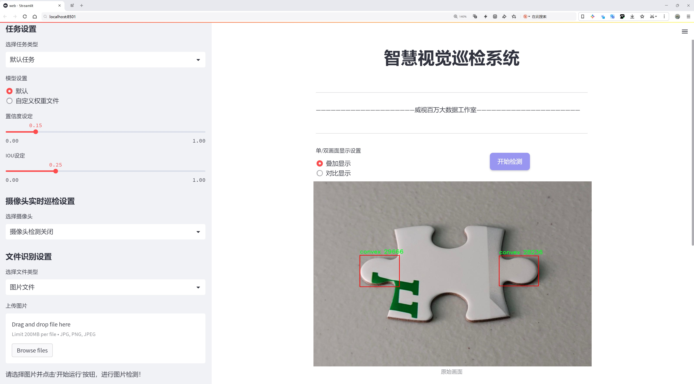
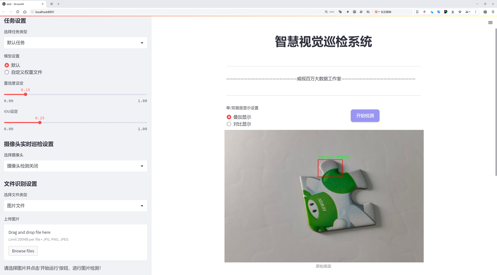
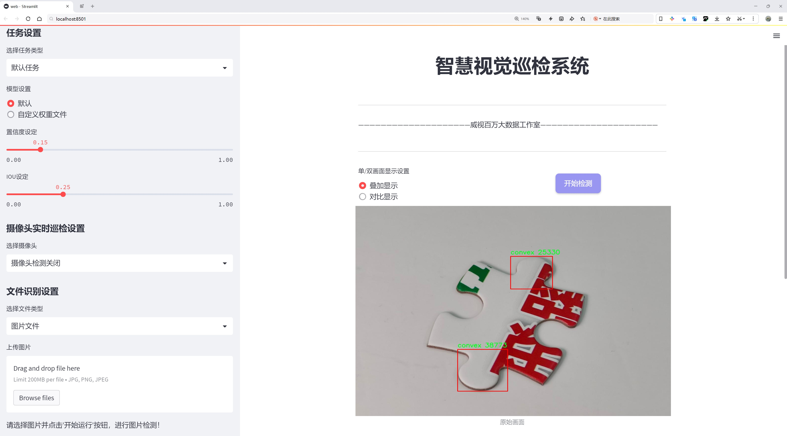
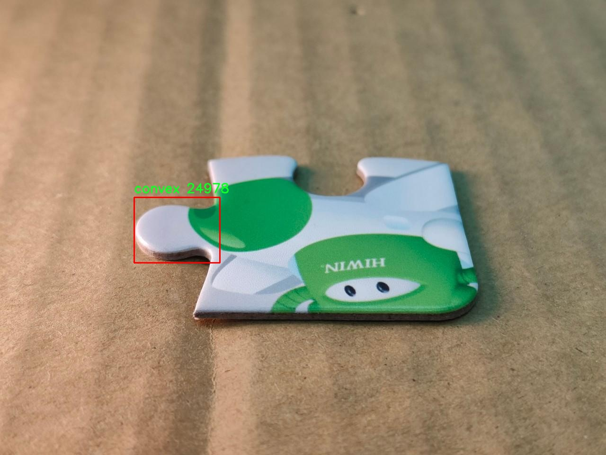
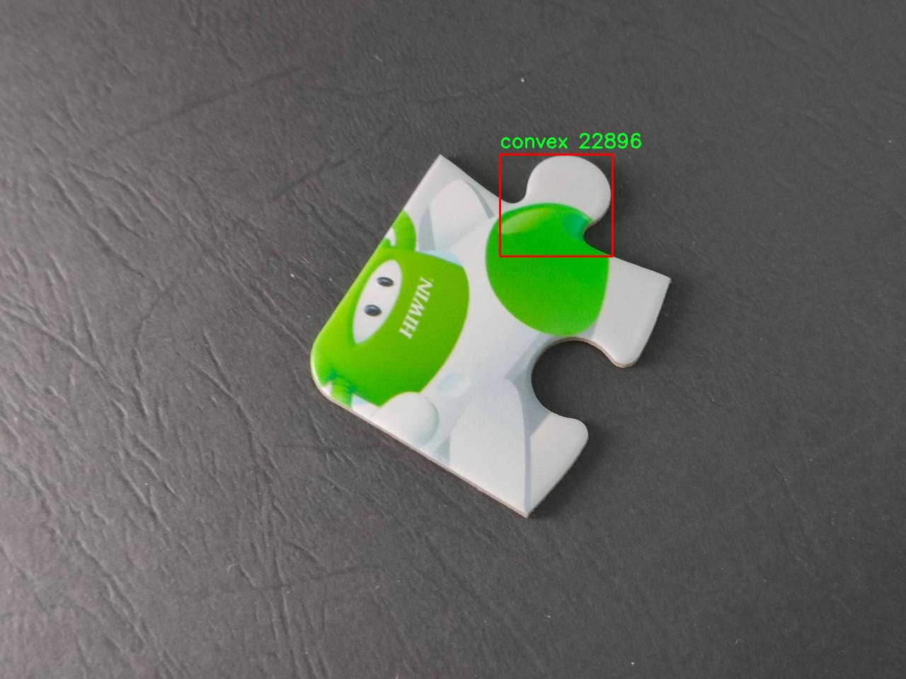
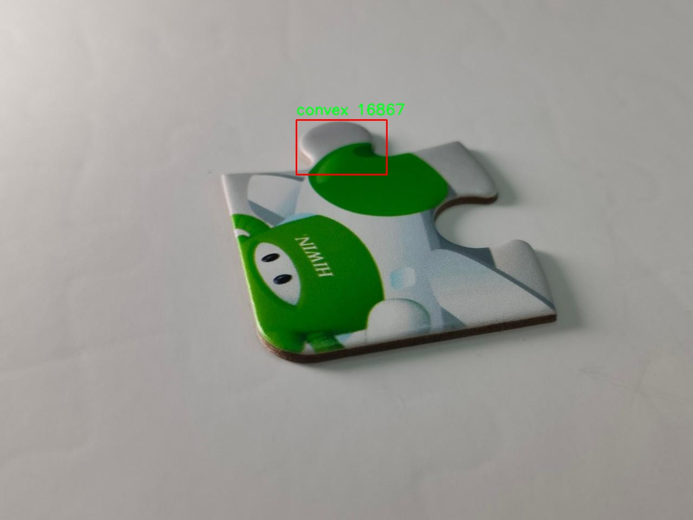
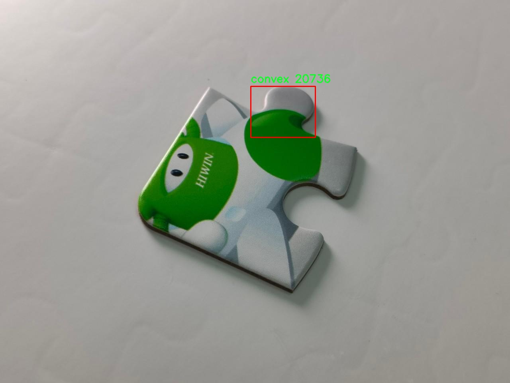
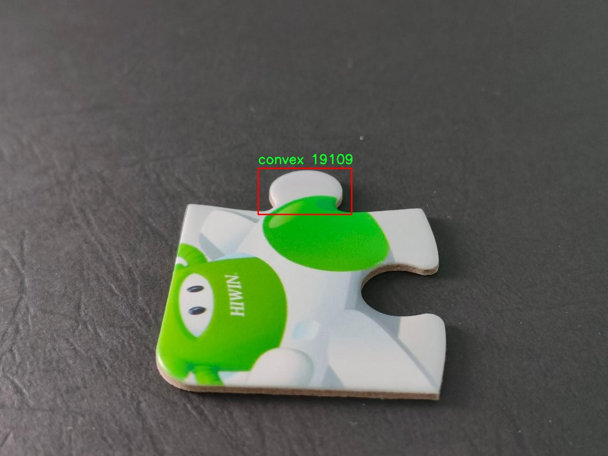

# 拼图缺口形状检测检测系统源码分享
 # [一条龙教学YOLOV8标注好的数据集一键训练_70+全套改进创新点发刊_Web前端展示]

### 1.研究背景与意义

项目参考[AAAI Association for the Advancement of Artificial Intelligence](https://gitee.com/qunmasj/projects)

项目来源[AACV Association for the Advancement of Computer Vision](https://kdocs.cn/l/cszuIiCKVNis)

研究背景与意义

随着人工智能技术的迅猛发展，计算机视觉领域的研究逐渐成为热点，其中目标检测技术的进步尤为显著。目标检测不仅在自动驾驶、安防监控等领域发挥着重要作用，还在工业制造、医疗影像分析等多个领域展现出广泛的应用潜力。近年来，YOLO（You Only Look Once）系列模型因其高效的实时检测能力和较好的检测精度而受到广泛关注。YOLOv8作为该系列的最新版本，在性能上进行了多项改进，具备了更强的特征提取能力和更快的推理速度，成为目标检测领域的重要工具。

在拼图游戏和相关产业中，拼图缺口形状的检测是一个关键问题。拼图的形状多样且复杂，尤其是在凸形和凹形拼图的组合中，准确识别缺口形状对于拼图的自动化拼接、智能化生产线以及游戏算法的优化具有重要意义。传统的拼图缺口检测方法多依赖于图像处理技术，如边缘检测和轮廓提取等，然而这些方法在复杂背景和光照变化下的鲁棒性较差，难以满足实际应用的需求。因此，基于深度学习的目标检测方法逐渐成为拼图缺口形状检测的研究热点。

本研究旨在基于改进的YOLOv8模型，构建一个高效的拼图缺口形状检测系统。我们使用的数据集包含2272张图像，涵盖了两类拼图缺口形状：凸形和复合凸形。这一数据集的构建为模型的训练和测试提供了丰富的样本，确保了模型在不同形状拼图缺口上的泛化能力。通过对YOLOv8模型的改进，我们将引入多种数据增强技术和模型优化策略，以提高模型在复杂场景下的检测精度和速度。

本研究的意义在于，不仅为拼图缺口形状的自动检测提供了一种新的解决方案，还推动了计算机视觉技术在特定领域的应用。通过构建高效的拼图缺口检测系统，我们可以为拼图生产线的自动化提供技术支持，降低人工成本，提高生产效率。此外，该系统的成功应用还可以为其他类似的形状检测任务提供借鉴，推动目标检测技术在更广泛领域的应用。

综上所述，基于改进YOLOv8的拼图缺口形状检测系统的研究，不仅具有重要的理论价值，也具备广泛的实际应用前景。随着拼图产业的不断发展和智能化需求的提升，相关技术的研究与应用将为行业带来新的机遇与挑战。我们期待通过本研究的深入，能够为拼图缺口形状检测领域提供新的思路和方法，推动相关技术的进步与发展。

### 2.图片演示







##### 注意：由于此博客编辑较早，上面“2.图片演示”和“3.视频演示”展示的系统图片或者视频可能为老版本，新版本在老版本的基础上升级如下：（实际效果以升级的新版本为准）

  （1）适配了YOLOV8的“目标检测”模型和“实例分割”模型，通过加载相应的权重（.pt）文件即可自适应加载模型。

  （2）支持“图片识别”、“视频识别”、“摄像头实时识别”三种识别模式。

  （3）支持“图片识别”、“视频识别”、“摄像头实时识别”三种识别结果保存导出，解决手动导出（容易卡顿出现爆内存）存在的问题，识别完自动保存结果并导出到tempDir中。

  （4）支持Web前端系统中的标题、背景图等自定义修改，后面提供修改教程。

  另外本项目提供训练的数据集和训练教程,暂不提供权重文件（best.pt）,需要您按照教程进行训练后实现图片演示和Web前端界面演示的效果。

### 3.视频演示

[3.1 视频演示](https://www.bilibili.com/video/BV12WsbejESu/)

### 4.数据集信息展示

##### 4.1 本项目数据集详细数据（类别数＆类别名）

nc: 1
names: ['convex']


##### 4.2 本项目数据集信息介绍

数据集信息展示

在本研究中，我们使用了名为“puzzleconvex”的数据集，旨在训练和改进YOLOv8模型，以实现高效的拼图缺口形状检测。该数据集专注于一种特定的形状类别，即“convex”，并为该类别提供了丰富的样本数据，以便模型能够准确识别和分类拼图中的凸形缺口。

“puzzleconvex”数据集的设计理念是为了满足拼图形状检测的需求，尤其是在凸形缺口的识别上。该数据集包含了多种不同的拼图样本，每个样本都经过精心标注，确保在训练过程中能够提供高质量的输入数据。数据集的单一类别“convex”代表了拼图中所有可能的凸形缺口，这一选择不仅简化了模型的训练过程，也使得检测任务更加聚焦，从而提高了检测的准确性和效率。

在数据集的构建过程中，研究团队收集了大量的拼图图像，涵盖了不同的拼图设计、颜色和背景。这些图像不仅包括了单独的拼图块，还包含了拼图在完成状态下的全景图，确保模型能够在多种环境下进行有效的学习。此外，数据集中的图像经过了多样化处理，包括旋转、缩放和颜色调整，以增强模型的鲁棒性，使其能够适应不同的实际应用场景。

为了确保数据集的标注质量，研究团队采用了专业的标注工具，对每个图像中的凸形缺口进行了精确的框选和标记。这一过程不仅提高了数据集的准确性，也为后续的模型训练提供了可靠的基础。通过这种方式，模型能够学习到凸形缺口的特征和模式，从而在实际应用中实现高效的检测。

在训练过程中，YOLOv8模型将利用“puzzleconvex”数据集中的样本进行学习，识别出拼图中的凸形缺口。由于该数据集的设计专注于单一类别，模型能够更深入地理解和掌握该类别的特征，从而提高检测的精度和速度。通过不断迭代训练，模型将逐渐优化其参数，以适应不同的拼图样本和环境变化。

总之，“puzzleconvex”数据集为本研究提供了一个坚实的基础，旨在通过高质量的样本和精确的标注，推动YOLOv8模型在拼图缺口形状检测领域的应用。随着模型的不断改进和优化，我们期待其在实际场景中的表现能够达到预期效果，为拼图识别技术的发展贡献力量。











### 5.全套项目环境部署视频教程（零基础手把手教学）

[5.1 环境部署教程链接（零基础手把手教学）](https://www.ixigua.com/7404473917358506534?logTag=c807d0cbc21c0ef59de5)


[5.2 安装Python虚拟环境创建和依赖库安装视频教程链接（零基础手把手教学）](https://www.ixigua.com/7404474678003106304?logTag=1f1041108cd1f708b01a)

### 6.手把手YOLOV8训练视频教程（零基础小白有手就能学会）

[6.1 手把手YOLOV8训练视频教程（零基础小白有手就能学会）](https://www.ixigua.com/7404477157818401292?logTag=d31a2dfd1983c9668658)

### 7.70+种全套YOLOV8创新点代码加载调参视频教程（一键加载写好的改进模型的配置文件）

[7.1 70+种全套YOLOV8创新点代码加载调参视频教程（一键加载写好的改进模型的配置文件）](https://www.ixigua.com/7404478314661806627?logTag=29066f8288e3f4eea3a4)

### 8.70+种全套YOLOV8创新点原理讲解（非科班也可以轻松写刊发刊，V10版本正在科研待更新）

由于篇幅限制，每个创新点的具体原理讲解就不一一展开，具体见下列网址中的创新点对应子项目的技术原理博客网址【Blog】：


[8.1 70+种全套YOLOV8创新点原理讲解链接](https://gitee.com/qunmasj/good)

### 9.系统功能展示（检测对象为举例，实际内容以本项目数据集为准）

图9.1.系统支持检测结果表格显示

  图9.2.系统支持置信度和IOU阈值手动调节

  图9.3.系统支持自定义加载权重文件best.pt(需要你通过步骤5中训练获得)

  图9.4.系统支持摄像头实时识别

  图9.5.系统支持图片识别

  图9.6.系统支持视频识别

  图9.7.系统支持识别结果文件自动保存

  图9.8.系统支持Excel导出检测结果数据


### 10.原始YOLOV8算法原理

原始YOLOv8算法原理

YOLOv8算法作为目标检测领域的最新进展，继承并发展了YOLO系列算法的核心思想，尤其是在速度和精度的平衡上做出了显著的优化。该算法的设计不仅仅是对前几代YOLO模型的简单迭代，而是结合了现代深度学习的多种先进技术，形成了一种更为高效和准确的目标检测方案。

首先，YOLOv8在骨干网络的设计上采用了跨级结构（Cross Stage Partial, CSP）的思想，这一设计理念旨在通过分割特征提取过程来减少计算量，同时保留重要的特征信息。具体而言，YOLOv8将YOLOv5中的C3模块进行了优化，替换为更加轻量化的C2f模块。这一变化不仅降低了模型的复杂度，还提升了特征提取的效率，使得YOLOv8在处理实时视频流时能够保持较高的帧率。

在特征提取的过程中，YOLOv8依然利用了空间金字塔池化（SPP）模块，这一模块通过多尺度特征的融合，增强了模型对不同尺寸目标的检测能力。同时，YOLOv8删除了上采样阶段中的卷积结构，进一步简化了网络结构，减少了不必要的计算开销。这种设计使得YOLOv8在保持高效性的同时，依然能够提取到丰富的特征信息，从而提升了目标检测的准确性。

在损失函数的设计上，YOLOv8引入了新的损失策略，通过变焦损失（Focal Loss）来计算分类损失。这一策略的引入使得模型在面对类别不平衡的情况下，能够更好地关注难以分类的样本，从而提升整体的检测性能。此外，YOLOv8还采用了数据平均保真度损失和完美交并比损失来计算边界框损失，这一创新的损失计算方式使得模型在定位目标时更加精确，能够有效减少假阳性和假阴性的发生。

YOLOv8的另一个重要特点是其样本匹配方式的改进。通过新的样本匹配策略，YOLOv8能够在高效率的基础上实现更为准确的目标检测。这一策略不仅提升了模型的检测精度，还使得其在处理复杂场景时表现得更加稳健。结合这些改进，YOLOv8在多个标准数据集上的表现均优于前代模型，展现出其在目标检测领域的强大潜力。

值得一提的是，YOLOv8还引入了Anchor-Free检测方式，这一方法的优势在于减少了对锚框的依赖，使得模型在检测过程中更加灵活。传统的锚框方法往往需要手动设计和调整，而YOLOv8通过解耦头结构的使用，使得目标检测的过程变得更加自动化和高效。这一创新使得YOLOv8在处理多种不同类型的目标时，能够更好地适应各种场景。

YOLOv8的颈部网络采用了PAN-FPN结构，这一结构通过特征多尺度融合，进一步提升了模型对小目标的检测能力。PAN-FPN的设计理念在于通过自底向上的特征传递，结合自顶向下的特征重用，形成一个高效的特征提取和融合机制。这一机制不仅提高了特征的表达能力，还增强了模型对不同尺度目标的适应性，使得YOLOv8在实际应用中表现得更加出色。

综上所述，YOLOv8算法通过对骨干网络、损失函数、样本匹配方式及检测结构的多方面优化，形成了一种高效、准确的目标检测方案。其在实时检测中的高精度和快速响应能力，使得YOLOv8在众多应用场景中展现出广泛的适用性。无论是在工业自动化、智能监控，还是在农业机器人等领域，YOLOv8都将成为推动目标检测技术发展的重要力量。通过对YOLOv8的深入研究和应用，未来的目标检测系统将能够更好地满足实际需求，为各行各业带来更多的便利与创新。


### 11.项目核心源码讲解（再也不用担心看不懂代码逻辑）

#### 11.1 ui.py

以下是经过简化和注释的核心代码部分：

```python
import sys
import subprocess
from QtFusion.path import abs_path

def run_script(script_path):
    """
    使用当前 Python 环境运行指定的脚本。

    Args:
        script_path (str): 要运行的脚本路径
    """
    # 获取当前 Python 解释器的路径
    python_path = sys.executable

    # 构建运行命令，使用 streamlit 运行指定的脚本
    command = f'"{python_path}" -m streamlit run "{script_path}"'

    # 执行命令，并等待其完成
    result = subprocess.run(command, shell=True)
    
    # 检查命令执行结果，如果返回码不为0，表示出错
    if result.returncode != 0:
        print("脚本运行出错。")

# 主程序入口
if __name__ == "__main__":
    # 获取脚本的绝对路径
    script_path = abs_path("web.py")

    # 运行指定的脚本
    run_script(script_path)
```

### 代码注释说明：
1. **导入模块**：
   - `sys`：用于获取当前 Python 解释器的路径。
   - `subprocess`：用于执行外部命令。
   - `abs_path`：从 `QtFusion.path` 模块导入，用于获取文件的绝对路径。

2. **`run_script` 函数**：
   - 该函数接受一个脚本路径作为参数，并使用当前 Python 环境运行该脚本。
   - 首先，通过 `sys.executable` 获取当前 Python 解释器的路径。
   - 然后，构建一个命令字符串，该命令使用 `streamlit` 运行指定的脚本。
   - 使用 `subprocess.run` 执行命令，并等待其完成。
   - 如果命令执行失败（返回码不为0），则打印错误信息。

3. **主程序入口**：
   - 使用 `if __name__ == "__main__":` 确保该代码块仅在直接运行脚本时执行。
   - 获取 `web.py` 脚本的绝对路径，并调用 `run_script` 函数运行该脚本。

这个程序文件名为 `ui.py`，主要功能是通过当前的 Python 环境来运行一个指定的脚本，具体是使用 Streamlit 框架来启动一个 Web 应用。

文件首先导入了必要的模块，包括 `sys`、`os` 和 `subprocess`。其中，`sys` 模块用于访问与 Python 解释器相关的变量和函数，`os` 模块提供了与操作系统交互的功能，而 `subprocess` 模块则用于生成新的进程、连接到它们的输入/输出/错误管道，并获取它们的返回码。此外，`abs_path` 函数从 `QtFusion.path` 模块中导入，用于获取文件的绝对路径。

在 `run_script` 函数中，首先定义了一个参数 `script_path`，它是要运行的脚本的路径。函数内部首先获取当前 Python 解释器的路径，这通过 `sys.executable` 实现。接着，构建一个命令字符串，该命令使用 Streamlit 运行指定的脚本。命令的格式是 `"{python_path}" -m streamlit run "{script_path}"`，其中 `{python_path}` 和 `{script_path}` 会被实际的路径替换。

然后，使用 `subprocess.run` 方法执行这个命令。`shell=True` 参数表示命令将在一个新的 shell 中执行。执行完命令后，检查返回码，如果返回码不为 0，表示脚本运行出错，此时会打印出错误信息。

在文件的最后部分，使用 `if __name__ == "__main__":` 来确保只有在直接运行该脚本时才会执行下面的代码。这里指定了要运行的脚本路径，调用 `abs_path` 函数获取 `web.py` 的绝对路径。最后，调用 `run_script` 函数来运行这个脚本。

总体来说，这个程序的主要作用是方便地启动一个基于 Streamlit 的 Web 应用，确保用户可以在当前的 Python 环境中运行指定的脚本。

#### 11.2 code\ui_style.py

以下是经过简化并注释的核心代码部分：

```python
import base64
import streamlit as st

# 读取二进制文件并转换为 Base64 编码
def get_base64_of_bin_file(bin_file):
    # 以二进制模式打开文件
    with open(bin_file, 'rb') as file:
        data = file.read()  # 读取文件内容
    # 将读取的二进制数据进行 Base64 编码并解码为字符串
    return base64.b64encode(data).decode()

# 定义 Streamlit 应用的 CSS 样式
def def_css_hitml():
    st.markdown("""
        <style>
        /* 全局样式 */
        .css-2trqyj, .css-1d391kg, .st-bb, .st-at {
            font-family: 'Gill Sans', 'Gill Sans MT', Calibri, 'Trebuchet MS', sans-serif;  /* 设置字体 */
            background-color: #cadefc;  /* 设置背景颜色 */
            color: #21618C;  /* 设置字体颜色 */
        }

        /* 按钮样式 */
        .stButton > button {
            border: none;  /* 去掉边框 */
            color: white;  /* 字体颜色 */
            padding: 10px 20px;  /* 内边距 */
            text-align: center;  /* 文本居中 */
            display: inline-block;  /* 使按钮为块级元素 */
            font-size: 16px;  /* 字体大小 */
            margin: 2px 1px;  /* 外边距 */
            cursor: pointer;  /* 鼠标悬停时显示手型光标 */
            border-radius: 8px;  /* 圆角边框 */
            background-color: #9896f1;  /* 按钮背景颜色 */
            box-shadow: 0 2px 4px 0 rgba(0,0,0,0.2);  /* 阴影效果 */
            transition-duration: 0.4s;  /* 过渡效果时间 */
        }
        .stButton > button:hover {
            background-color: #5499C7;  /* 悬停时背景颜色 */
            color: white;  /* 悬停时字体颜色 */
            box-shadow: 0 8px 12px 0 rgba(0,0,0,0.24);  /* 悬停时阴影效果 */
        }

        /* 侧边栏样式 */
        .css-1lcbmhc.e1fqkh3o0 {
            background-color: #154360;  /* 侧边栏背景颜色 */
            color: #FDFEFE;  /* 侧边栏字体颜色 */
            border-right: 2px solid #DDD;  /* 右边框 */
        }

        /* 表格样式 */
        table {
            border-collapse: collapse;  /* 合并边框 */
            margin: 25px 0;  /* 外边距 */
            font-size: 18px;  /* 字体大小 */
            font-family: sans-serif;  /* 字体 */
            min-width: 400px;  /* 最小宽度 */
            box-shadow: 0 5px 15px rgba(0, 0, 0, 0.2);  /* 阴影效果 */
        }
        thead tr {
            background-color: #a8d8ea;  /* 表头背景颜色 */
            color: #ffcef3;  /* 表头字体颜色 */
            text-align: left;  /* 表头文本左对齐 */
        }
        th, td {
            padding: 15px 18px;  /* 单元格内边距 */
        }
        tbody tr {
            border-bottom: 2px solid #ddd;  /* 行底部边框 */
        }
        tbody tr:nth-of-type(even) {
            background-color: #D6EAF8;  /* 偶数行背景颜色 */
        }
        tbody tr:last-of-type {
            border-bottom: 3px solid #5499C7;  /* 最后一行底部边框 */
        }
        tbody tr:hover {
            background-color: #AED6F1;  /* 悬停行背景颜色 */
        }
        </style>
        """, unsafe_allow_html=True)  # 允许使用 HTML
```

### 代码说明：
1. **`get_base64_of_bin_file` 函数**：该函数用于读取指定的二进制文件，并将其内容转换为 Base64 编码的字符串。使用 `base64` 模块进行编码，适用于需要将二进制数据嵌入到 HTML 或 JSON 中的场景。

2. **`def_css_hitml` 函数**：该函数定义了 Streamlit 应用的 CSS 样式。通过 `st.markdown` 方法将 CSS 样式嵌入到应用中，使用 `unsafe_allow_html=True` 允许渲染 HTML 内容。样式包括全局样式、按钮样式、侧边栏样式和表格样式等，旨在提升应用的视觉效果和用户体验。

这个程序文件 `ui_style.py` 是一个用于定义 Streamlit 应用程序界面样式的 Python 脚本。它主要包含两个功能：读取二进制文件并将其转换为 Base64 编码，以及定义应用程序的 CSS 样式。

首先，文件中导入了 `base64` 和 `streamlit` 模块。`base64` 模块用于处理 Base64 编码，而 `streamlit` 是一个用于构建数据应用的库。

接下来，定义了一个名为 `get_base64_of_bin_file` 的函数，该函数接受一个二进制文件的路径作为参数。它打开该文件并以二进制模式读取其内容，然后使用 `base64.b64encode` 将数据编码为 Base64 格式，并将其解码为字符串形式返回。这种功能通常用于在网页中嵌入图像或其他二进制数据。

然后，定义了一个名为 `def_css_hitml` 的函数。在这个函数中，使用 `st.markdown` 方法插入了一段 CSS 样式代码，以便自定义 Streamlit 应用的外观。CSS 样式包括全局样式、按钮样式、侧边栏样式、单选按钮样式、滑块样式、表格样式等。

具体来说，全局样式设置了字体、背景色和文字颜色。按钮样式定义了按钮的边框、颜色、内边距、字体大小、边距、光标样式、圆角和背景色等，并且在鼠标悬停时改变背景色和阴影效果。侧边栏的样式设置了背景色、文字颜色和边框。单选按钮和滑块的样式则调整了它们的外观，使其更加美观。

最后，表格的样式定义了表格的边框、阴影、字体、最小宽度、行的背景色、悬停效果等。这些样式的设置使得表格在显示数据时更加清晰和易于阅读。

总的来说，这个文件通过定义样式和处理图像文件，为 Streamlit 应用提供了一个美观且功能丰富的用户界面。

#### 11.3 code\ultralytics\models\yolo\classify\__init__.py

```python
# 导入Ultralytics YOLO库中的分类模型相关模块
# Ultralytics YOLO 🚀, AGPL-3.0 license

# 导入分类预测器，用于对图像进行分类预测
from ultralytics.models.yolo.classify.predict import ClassificationPredictor

# 导入分类训练器，用于训练分类模型
from ultralytics.models.yolo.classify.train import ClassificationTrainer

# 导入分类验证器，用于验证分类模型的性能
from ultralytics.models.yolo.classify.val import ClassificationValidator

# 定义模块的公开接口，指定可以被外部访问的类
__all__ = "ClassificationPredictor", "ClassificationTrainer", "ClassificationValidator"
```

### 代码注释说明：
1. **导入模块**：
   - `ClassificationPredictor`：用于进行图像分类的预测，能够对输入的图像进行分类并返回结果。
   - `ClassificationTrainer`：用于训练分类模型，通过提供训练数据来优化模型参数。
   - `ClassificationValidator`：用于验证训练好的模型的性能，通常会使用验证集来评估模型的准确性和其他指标。

2. **公开接口**：
   - `__all__`：这是一个特殊变量，用于定义模块的公共接口，指定哪些类或函数可以被外部导入。这里定义了三个类，使得使用该模块的用户可以直接访问这些功能。

这个程序文件是一个Python模块的初始化文件，位于Ultralytics YOLO项目的分类模型目录下。文件的主要功能是导入和暴露该模块中的三个主要类：`ClassificationPredictor`、`ClassificationTrainer`和`ClassificationValidator`。

首先，文件顶部的注释部分表明这是Ultralytics YOLO项目的一部分，并且遵循AGPL-3.0许可证。这意味着该代码是开源的，用户可以自由使用和修改，但需要遵循相应的许可证条款。

接下来，文件通过`from`语句导入了三个类。这些类分别负责不同的功能：

1. `ClassificationPredictor`：这个类可能用于进行分类预测，即使用训练好的模型对新数据进行分类。
2. `ClassificationTrainer`：这个类用于训练分类模型，可能包含模型的构建、训练过程的管理以及参数的调整等功能。
3. `ClassificationValidator`：这个类用于验证分类模型的性能，通常会在训练后对模型进行评估，以确保其在未见数据上的表现。

最后，`__all__`变量定义了当使用`from module import *`语句时，哪些名称会被导入。在这里，它指定了`ClassificationPredictor`、`ClassificationTrainer`和`ClassificationValidator`这三个类，使得它们可以被外部模块直接访问。

总的来说，这个文件的作用是组织和简化分类模型相关功能的导入，使得其他模块在使用这些功能时更加方便。

#### 11.4 train.py

以下是代码中最核心的部分，并附上详细的中文注释：

```python
class DetectionTrainer(BaseTrainer):
    """
    扩展自 BaseTrainer 类的检测模型训练类。
    """

    def build_dataset(self, img_path, mode="train", batch=None):
        """
        构建 YOLO 数据集。

        参数:
            img_path (str): 包含图像的文件夹路径。
            mode (str): 模式，可以是 'train' 或 'val'，用户可以为每种模式自定义不同的增强。
            batch (int, optional): 批次大小，仅用于 'rect' 模式。默认为 None。
        """
        gs = max(int(de_parallel(self.model).stride.max() if self.model else 0), 32)
        return build_yolo_dataset(self.args, img_path, batch, self.data, mode=mode, rect=mode == "val", stride=gs)

    def get_dataloader(self, dataset_path, batch_size=16, rank=0, mode="train"):
        """构造并返回数据加载器。"""
        assert mode in ["train", "val"]  # 确保模式是 'train' 或 'val'
        with torch_distributed_zero_first(rank):  # 仅在 DDP 中初始化数据集 *.cache 一次
            dataset = self.build_dataset(dataset_path, mode, batch_size)  # 构建数据集
        shuffle = mode == "train"  # 训练模式下打乱数据
        if getattr(dataset, "rect", False) and shuffle:
            LOGGER.warning("WARNING ⚠️ 'rect=True' 与 DataLoader shuffle 不兼容，设置 shuffle=False")
            shuffle = False  # 如果使用 rect 模式，禁用打乱
        workers = self.args.workers if mode == "train" else self.args.workers * 2  # 根据模式设置工作线程数
        return build_dataloader(dataset, batch_size, workers, shuffle, rank)  # 返回数据加载器

    def preprocess_batch(self, batch):
        """对一批图像进行预处理，包括缩放和转换为浮点数。"""
        batch["img"] = batch["img"].to(self.device, non_blocking=True).float() / 255  # 将图像转换为浮点数并归一化
        if self.args.multi_scale:  # 如果启用多尺度
            imgs = batch["img"]
            sz = (
                random.randrange(self.args.imgsz * 0.5, self.args.imgsz * 1.5 + self.stride)
                // self.stride
                * self.stride
            )  # 随机选择新的尺寸
            sf = sz / max(imgs.shape[2:])  # 计算缩放因子
            if sf != 1:  # 如果缩放因子不为1
                ns = [
                    math.ceil(x * sf / self.stride) * self.stride for x in imgs.shape[2:]
                ]  # 计算新的形状
                imgs = nn.functional.interpolate(imgs, size=ns, mode="bilinear", align_corners=False)  # 进行插值
            batch["img"] = imgs  # 更新批次图像
        return batch

    def set_model_attributes(self):
        """设置模型的属性，包括类别数量和名称。"""
        self.model.nc = self.data["nc"]  # 将类别数量附加到模型
        self.model.names = self.data["names"]  # 将类别名称附加到模型
        self.model.args = self.args  # 将超参数附加到模型

    def get_model(self, cfg=None, weights=None, verbose=True):
        """返回 YOLO 检测模型。"""
        model = DetectionModel(cfg, nc=self.data["nc"], verbose=verbose and RANK == -1)  # 创建检测模型
        if weights:
            model.load(weights)  # 加载权重
        return model

    def get_validator(self):
        """返回用于 YOLO 模型验证的 DetectionValidator。"""
        self.loss_names = "box_loss", "cls_loss", "dfl_loss"  # 定义损失名称
        return yolo.detect.DetectionValidator(
            self.test_loader, save_dir=self.save_dir, args=copy(self.args), _callbacks=self.callbacks
        )

    def plot_training_samples(self, batch, ni):
        """绘制带有注释的训练样本。"""
        plot_images(
            images=batch["img"],
            batch_idx=batch["batch_idx"],
            cls=batch["cls"].squeeze(-1),
            bboxes=batch["bboxes"],
            paths=batch["im_file"],
            fname=self.save_dir / f"train_batch{ni}.jpg",
            on_plot=self.on_plot,
        )
```

### 代码说明：
1. **DetectionTrainer 类**：这是一个用于训练 YOLO 检测模型的类，继承自 `BaseTrainer`。
2. **build_dataset 方法**：根据给定的图像路径和模式构建数据集，支持训练和验证模式。
3. **get_dataloader 方法**：构造数据加载器，支持多线程和数据打乱。
4. **preprocess_batch 方法**：对输入的图像批次进行预处理，包括归一化和可能的缩放。
5. **set_model_attributes 方法**：设置模型的类别数量和名称等属性。
6. **get_model 方法**：返回一个 YOLO 检测模型，并可选择加载预训练权重。
7. **get_validator 方法**：返回用于模型验证的验证器。
8. **plot_training_samples 方法**：绘制训练样本及其注释，便于可视化训练过程。

这个程序文件 `train.py` 是一个用于训练 YOLO（You Only Look Once）目标检测模型的实现，继承自 `BaseTrainer` 类。它包含了多个方法，用于构建数据集、获取数据加载器、预处理图像、设置模型属性、获取模型、验证模型、记录损失、显示训练进度、绘制训练样本和绘制训练指标等功能。

首先，`DetectionTrainer` 类的构造函数中定义了如何构建 YOLO 数据集。`build_dataset` 方法接受图像路径、模式（训练或验证）和批次大小作为参数，利用 `build_yolo_dataset` 函数构建数据集。在数据集构建过程中，会根据模型的步幅（stride）来确定输入图像的大小。

接下来，`get_dataloader` 方法用于创建数据加载器。它会根据模式（训练或验证）来决定是否打乱数据，并且在分布式训练中只初始化数据集一次。数据加载器的工作线程数量在训练模式下会增加，以提高数据加载效率。

在图像预处理方面，`preprocess_batch` 方法将图像缩放到合适的大小，并将像素值归一化到 [0, 1] 的范围内。如果启用了多尺度训练，图像的大小会在一定范围内随机选择，从而增强模型的鲁棒性。

`set_model_attributes` 方法用于设置模型的属性，包括类别数量和类别名称。这些信息是从数据集中提取的，并将其附加到模型上，以便模型能够正确处理不同的类别。

获取 YOLO 检测模型的过程由 `get_model` 方法完成。该方法可以根据配置文件和权重文件返回一个 YOLO 检测模型实例。

在模型验证方面，`get_validator` 方法返回一个用于验证 YOLO 模型的验证器，能够记录训练过程中的损失值。

损失记录的功能由 `label_loss_items` 方法实现，该方法返回一个包含训练损失项的字典，便于后续分析。

为了跟踪训练进度，`progress_string` 方法返回一个格式化的字符串，显示当前的训练轮次、GPU 内存使用情况、损失值、实例数量和图像大小等信息。

在训练过程中，`plot_training_samples` 方法会绘制训练样本及其标注，帮助可视化训练数据的质量。`plot_metrics` 和 `plot_training_labels` 方法则用于绘制训练过程中的指标和标签，以便于分析模型的性能和训练效果。

总体而言，这个程序文件实现了 YOLO 模型训练的核心功能，提供了灵活的数据处理和模型训练接口，适用于目标检测任务。

#### 11.5 70+种YOLOv8算法改进源码大全和调试加载训练教程（非必要）\ultralytics\engine\results.py

以下是代码中最核心的部分，并附上详细的中文注释：

```python
class BaseTensor(SimpleClass):
    """基础张量类，提供方便的操作和设备处理方法。"""

    def __init__(self, data, orig_shape) -> None:
        """
        初始化 BaseTensor，包含数据和原始形状。

        参数:
            data (torch.Tensor | np.ndarray): 预测结果，例如边界框、掩码和关键点。
            orig_shape (tuple): 图像的原始形状。
        """
        assert isinstance(data, (torch.Tensor, np.ndarray))  # 确保数据是张量或数组
        self.data = data  # 存储数据
        self.orig_shape = orig_shape  # 存储原始形状

    @property
    def shape(self):
        """返回数据张量的形状。"""
        return self.data.shape

    def cpu(self):
        """返回一个在CPU内存上的张量副本。"""
        return self if isinstance(self.data, np.ndarray) else self.__class__(self.data.cpu(), self.orig_shape)

    def numpy(self):
        """返回一个作为numpy数组的张量副本。"""
        return self if isinstance(self.data, np.ndarray) else self.__class__(self.data.numpy(), self.orig_shape)

    def cuda(self):
        """返回一个在GPU内存上的张量副本。"""
        return self.__class__(torch.as_tensor(self.data).cuda(), self.orig_shape)

    def to(self, *args, **kwargs):
        """返回一个在指定设备和数据类型上的张量副本。"""
        return self.__class__(torch.as_tensor(self.data).to(*args, **kwargs), self.orig_shape)

    def __len__(self):  # 重写len(results)
        """返回数据张量的长度。"""
        return len(self.data)

    def __getitem__(self, idx):
        """返回指定索引的数据张量的 BaseTensor 对象。"""
        return self.__class__(self.data[idx], self.orig_shape)


class Results(SimpleClass):
    """
    存储和操作推理结果的类。

    参数:
        orig_img (numpy.ndarray): 原始图像的numpy数组。
        path (str): 图像文件的路径。
        names (dict): 类名字典。
        boxes (torch.tensor, optional): 每个检测的边界框坐标的2D张量。
        masks (torch.tensor, optional): 检测掩码的3D张量，每个掩码是一个二进制图像。
        probs (torch.tensor, optional): 每个类的概率的1D张量。
        keypoints (List[List[float]], optional): 每个对象的检测关键点列表。

    属性:
        orig_img (numpy.ndarray): 原始图像的numpy数组。
        orig_shape (tuple): 原始图像的形状（高度，宽度）。
        boxes (Boxes, optional): 包含检测边界框的 Boxes 对象。
        masks (Masks, optional): 包含检测掩码的 Masks 对象。
        probs (Probs, optional): 包含分类任务中每个类概率的 Probs 对象。
        keypoints (Keypoints, optional): 包含每个对象检测关键点的 Keypoints 对象。
    """

    def __init__(self, orig_img, path, names, boxes=None, masks=None, probs=None, keypoints=None) -> None:
        """初始化 Results 类。"""
        self.orig_img = orig_img  # 存储原始图像
        self.orig_shape = orig_img.shape[:2]  # 存储原始图像的形状
        self.boxes = Boxes(boxes, self.orig_shape) if boxes is not None else None  # 存储边界框
        self.masks = Masks(masks, self.orig_shape) if masks is not None else None  # 存储掩码
        self.probs = Probs(probs) if probs is not None else None  # 存储概率
        self.keypoints = Keypoints(keypoints, self.orig_shape) if keypoints is not None else None  # 存储关键点
        self.names = names  # 存储类名
        self.path = path  # 存储图像路径

    def __getitem__(self, idx):
        """返回指定索引的 Results 对象。"""
        return self._apply('__getitem__', idx)

    def __len__(self):
        """返回 Results 对象中的检测数量。"""
        for k in ('boxes', 'masks', 'probs', 'keypoints'):
            v = getattr(self, k)
            if v is not None:
                return len(v)

    def update(self, boxes=None, masks=None, probs=None):
        """更新 Results 对象的 boxes、masks 和 probs 属性。"""
        if boxes is not None:
            self.boxes = Boxes(boxes, self.orig_shape)  # 更新边界框
        if masks is not None:
            self.masks = Masks(masks, self.orig_shape)  # 更新掩码
        if probs is not None:
            self.probs = probs  # 更新概率

    def plot(self, conf=True, boxes=True, masks=True, probs=True):
        """
        在输入的RGB图像上绘制检测结果。

        参数:
            conf (bool): 是否绘制检测置信度分数。
            boxes (bool): 是否绘制边界框。
            masks (bool): 是否绘制掩码。
            probs (bool): 是否绘制分类概率。

        返回:
            (numpy.ndarray): 带注释的图像的numpy数组。
        """
        # 绘制逻辑...
        return annotator.result()  # 返回绘制结果


class Boxes(BaseTensor):
    """
    存储和操作检测框的类。

    参数:
        boxes (torch.Tensor | numpy.ndarray): 包含检测框的张量或数组。
        orig_shape (tuple): 原始图像大小，格式为（高度，宽度）。
    """

    def __init__(self, boxes, orig_shape) -> None:
        """初始化 Boxes 类。"""
        super().__init__(boxes, orig_shape)  # 调用父类构造函数

    @property
    def xyxy(self):
        """返回 xyxy 格式的边界框。"""
        return self.data[:, :4]

    @property
    def conf(self):
        """返回边界框的置信度值。"""
        return self.data[:, -2]

    @property
    def cls(self):
        """返回边界框的类值。"""
        return self.data[:, -1]


class Masks(BaseTensor):
    """
    存储和操作检测掩码的类。
    """

    def __init__(self, masks, orig_shape) -> None:
        """初始化 Masks 类。"""
        super().__init__(masks, orig_shape)  # 调用父类构造函数

    @property
    def xyn(self):
        """返回归一化的分段。"""
        return [
            ops.scale_coords(self.data.shape[1:], x, self.orig_shape, normalize=True)
            for x in ops.masks2segments(self.data)]


class Keypoints(BaseTensor):
    """
    存储和操作检测关键点的类。
    """

    def __init__(self, keypoints, orig_shape) -> None:
        """初始化 Keypoints 类。"""
        super().__init__(keypoints, orig_shape)  # 调用父类构造函数

    @property
    def xy(self):
        """返回关键点的 x, y 坐标。"""
        return self.data[..., :2]

    @property
    def xyn(self):
        """返回归一化的 x, y 坐标。"""
        xy = self.xy.clone() if isinstance(self.xy, torch.Tensor) else np.copy(self.xy)
        xy[..., 0] /= self.orig_shape[1]
        xy[..., 1] /= self.orig_shape[0]
        return xy
```

以上代码是 YOLO 推理结果处理的核心部分，包括基础张量类、结果类、边界框、掩码和关键点的处理。每个类都有详细的中文注释，说明其功能和参数。

这个程序文件是一个关于Ultralytics YOLO（You Only Look Once）算法的结果处理模块，主要用于处理推理结果，包括检测框、掩码、关键点和分类概率等。该模块定义了多个类，分别用于存储和操作不同类型的推理结果。

首先，`BaseTensor`类是一个基础类，提供了一些方便的方法来处理张量数据，包括在CPU和GPU之间的转换、获取数据形状、以及索引访问等。它支持输入数据为PyTorch张量或NumPy数组，并且可以在不同设备之间进行转换。

接下来是`Results`类，它用于存储和操作推理结果。该类的构造函数接收原始图像、图像路径、类别名称、检测框、掩码、概率和关键点等信息。它包含多个属性来存储这些信息，并提供了一些方法来更新结果、转换设备、绘制结果以及保存结果等。

`Boxes`、`Masks`、`Keypoints`和`Probs`类分别用于处理检测框、掩码、关键点和分类概率。每个类都继承自`BaseTensor`，并提供了特定的属性和方法来处理各自的数据类型。例如，`Boxes`类提供了获取边界框坐标、置信度、类别等信息的方法；`Masks`类则用于处理检测到的掩码数据。

`Results`类还提供了绘制检测结果的功能，可以将检测框、掩码、关键点等信息绘制到输入图像上，并返回标注后的图像。此外，它还支持将结果保存为文本文件或JSON格式，以便后续使用。

总体来说，这个模块为YOLO算法的推理结果提供了全面的处理能力，使得用户可以方便地操作和可视化检测结果。通过这些类和方法，用户可以轻松地获取和保存推理结果，进行进一步的分析和处理。

#### 11.6 code\ultralytics\nn\modules\utils.py

以下是经过简化和注释的核心代码部分：

```python
import torch
import torch.nn.functional as F

def inverse_sigmoid(x, eps=1e-5):
    """
    计算张量的反sigmoid函数。
    
    参数:
    x: 输入张量，值应在[0, 1]范围内。
    eps: 防止除零的极小值，默认为1e-5。
    
    返回:
    反sigmoid计算结果的张量。
    """
    # 限制x的范围在0到1之间
    x = x.clamp(min=0, max=1)
    # 将x限制在eps以上，以避免后续计算中的除零错误
    x1 = x.clamp(min=eps)
    x2 = (1 - x).clamp(min=eps)
    # 计算反sigmoid值
    return torch.log(x1 / x2)

def multi_scale_deformable_attn_pytorch(
    value: torch.Tensor,
    value_spatial_shapes: torch.Tensor,
    sampling_locations: torch.Tensor,
    attention_weights: torch.Tensor,
) -> torch.Tensor:
    """
    多尺度可变形注意力机制。
    
    参数:
    value: 输入特征张量，形状为 (batch_size, channels, num_heads, embed_dims)。
    value_spatial_shapes: 输入特征的空间形状，形状为 (num_levels, 2)。
    sampling_locations: 采样位置，形状为 (batch_size, num_queries, num_heads, num_levels, num_points, 2)。
    attention_weights: 注意力权重，形状为 (batch_size, num_heads, num_queries, num_levels, num_points)。
    
    返回:
    经过多尺度可变形注意力机制处理后的输出张量。
    """
    bs, _, num_heads, embed_dims = value.shape  # 获取输入特征的形状
    _, num_queries, _, num_levels, num_points, _ = sampling_locations.shape  # 获取采样位置的形状

    # 将输入特征按空间形状分割成多个特征图
    value_list = value.split([H_ * W_ for H_, W_ in value_spatial_shapes], dim=1)
    # 计算采样网格
    sampling_grids = 2 * sampling_locations - 1
    sampling_value_list = []

    for level, (H_, W_) in enumerate(value_spatial_shapes):
        # 处理每个尺度的特征图
        value_l_ = value_list[level].flatten(2).transpose(1, 2).reshape(bs * num_heads, embed_dims, H_, W_)
        sampling_grid_l_ = sampling_grids[:, :, :, level].transpose(1, 2).flatten(0, 1)
        
        # 使用双线性插值从特征图中采样
        sampling_value_l_ = F.grid_sample(
            value_l_, sampling_grid_l_, mode="bilinear", padding_mode="zeros", align_corners=False
        )
        sampling_value_list.append(sampling_value_l_)

    # 处理注意力权重并计算最终输出
    attention_weights = attention_weights.transpose(1, 2).reshape(
        bs * num_heads, 1, num_queries, num_levels * num_points
    )
    output = (
        (torch.stack(sampling_value_list, dim=-2).flatten(-2) * attention_weights)
        .sum(-1)
        .view(bs, num_heads * embed_dims, num_queries)
    )
    
    return output.transpose(1, 2).contiguous()  # 返回最终输出
```

### 代码说明：
1. **inverse_sigmoid函数**：计算输入张量的反sigmoid值，确保输入在[0, 1]范围内，并使用`eps`避免除零错误。
2. **multi_scale_deformable_attn_pytorch函数**：实现多尺度可变形注意力机制，输入特征经过空间分割、采样和加权处理，最终输出经过注意力机制加权的特征张量。

这个程序文件是Ultralytics YOLO项目中的一个模块，主要用于实现一些深度学习模型的工具函数和操作。代码中包含了多个函数，下面对这些函数进行逐一说明。

首先，文件导入了一些必要的库，包括`copy`、`math`、`numpy`、`torch`及其子模块`torch.nn`和`torch.nn.functional`。这些库提供了深度学习所需的基本功能和数学运算。

`_get_clones(module, n)`函数用于创建一个给定模块的克隆列表。它使用`copy.deepcopy`来复制模块，以确保每个克隆都是独立的实例，返回一个`nn.ModuleList`，其中包含`n`个克隆的模块。

`bias_init_with_prob(prior_prob=0.01)`函数用于根据给定的概率值初始化卷积或全连接层的偏置值。它通过计算负对数来返回一个合适的偏置初始化值，以确保模型在训练初期的输出符合期望的概率分布。

`linear_init(module)`函数用于初始化线性模块的权重和偏置。它使用均匀分布在一个特定的范围内初始化权重，并且如果模块有偏置，则也会对偏置进行相同的初始化。

`inverse_sigmoid(x, eps=1e-5)`函数计算输入张量的反sigmoid函数。它首先将输入限制在0到1之间，然后计算sigmoid的反函数，避免了数值不稳定性的问题。

`multi_scale_deformable_attn_pytorch`函数实现了多尺度可变形注意力机制。该函数接收多个输入参数，包括值张量、空间形状、采样位置和注意力权重。它首先将输入的值张量根据空间形状进行分割，然后计算采样网格，并使用`F.grid_sample`函数对每个层级的值进行采样。接着，它对采样值进行加权求和，最终返回一个经过转置和连续化处理的输出张量。

总体而言，这个模块提供了一些基础的工具函数，特别是在处理深度学习模型的初始化和注意力机制方面。这些函数在YOLO模型的实现中起到了重要的辅助作用。

### 12.系统整体结构（节选）

### 整体功能和构架概括

该项目是一个基于YOLO（You Only Look Once）算法的目标检测框架，主要用于实现目标检测、分类、训练和推理等功能。整体架构由多个模块组成，每个模块负责特定的功能，便于维护和扩展。以下是各个模块的主要功能：

- **用户界面（UI）模块**：提供了Streamlit应用的界面，用于可视化和交互。
- **样式模块**：定义了UI的样式和外观，使得应用更加美观。
- **模型模块**：包含了YOLO模型的分类功能，提供了训练、预测和验证的接口。
- **训练模块**：实现了YOLO模型的训练过程，包括数据加载、预处理、模型初始化和训练监控等。
- **结果处理模块**：用于处理模型推理的结果，包括检测框、掩码和关键点等。
- **工具模块**：提供了一些深度学习相关的工具函数，如初始化、注意力机制等。

以下是各个文件的功能整理表格：

| 文件路径                                                                                       | 功能描述                                                   |
|------------------------------------------------------------------------------------------------|----------------------------------------------------------|
| `D:\tools\20240809\code\ui.py`                                                                | 启动Streamlit应用，运行指定的YOLO脚本。                   |
| `D:\tools\20240809\code\code\ui_style.py`                                                    | 定义Streamlit应用的CSS样式和界面美化。                    |
| `D:\tools\20240809\code\code\ultralytics\models\yolo\classify\__init__.py`                 | 导入和暴露YOLO分类模型相关的类。                          |
| `D:\tools\20240809\code\train.py`                                                            | 实现YOLO模型的训练过程，包括数据集构建和训练监控。       |
| `D:\tools\20240809\code\70+种YOLOv8算法改进源码大全和调试加载训练教程（非必要）\ultralytics\engine\results.py` | 处理推理结果，包括检测框、掩码和关键点的存储与操作。     |
| `D:\tools\20240809\code\ultralytics\nn\modules\utils.py`                                     | 提供深度学习模型的工具函数，如初始化和注意力机制。       |
| `D:\tools\20240809\code\70+种YOLOv8算法改进源码大全和调试加载训练教程（非必要）\ultralytics\utils\dist.py` | 实现分布式训练的相关功能。                                 |
| `D:\tools\20240809\code\70+种YOLOv8算法改进源码大全和调试加载训练教程（非必要）\ultralytics\data\loaders.py` | 提供数据加载器，用于加载和预处理训练数据。               |
| `D:\tools\20240809\code\ultralytics\data\__init__.py`                                       | 导入和暴露数据处理相关的模块和类。                        |
| `D:\tools\20240809\code\ultralytics\trackers\basetrack.py`                                   | 实现基础的目标跟踪功能。                                   |
| `D:\tools\20240809\code\70+种YOLOv8算法改进源码大全和调试加载训练教程（非必要）\ultralytics\__init__.py` | 初始化Ultralytics包，设置模块导入。                       |
| `D:\tools\20240809\code\70+种YOLOv8算法改进源码大全和调试加载训练教程（非必要）\ultralytics\nn\extra_modules\attention.py` | 实现额外的注意力机制模块。                                 |
| `D:\tools\20240809\code\70+种YOLOv8算法改进源码大全和调试加载训练教程（非必要）\ultralytics\models\utils\loss.py` | 定义损失函数，用于模型训练中的损失计算。                  |

这个表格总结了每个文件的主要功能，帮助理解整个项目的结构和各个模块之间的关系。

注意：由于此博客编辑较早，上面“11.项目核心源码讲解（再也不用担心看不懂代码逻辑）”中部分代码可能会优化升级，仅供参考学习，完整“训练源码”、“Web前端界面”和“70+种创新点源码”以“13.完整训练+Web前端界面+70+种创新点源码、数据集获取”的内容为准。

### 13.完整训练+Web前端界面+70+种创新点源码、数据集获取


# [下载链接：https://mbd.pub/o/bread/ZpuZkp9y](https://mbd.pub/o/bread/ZpuZkp9y)